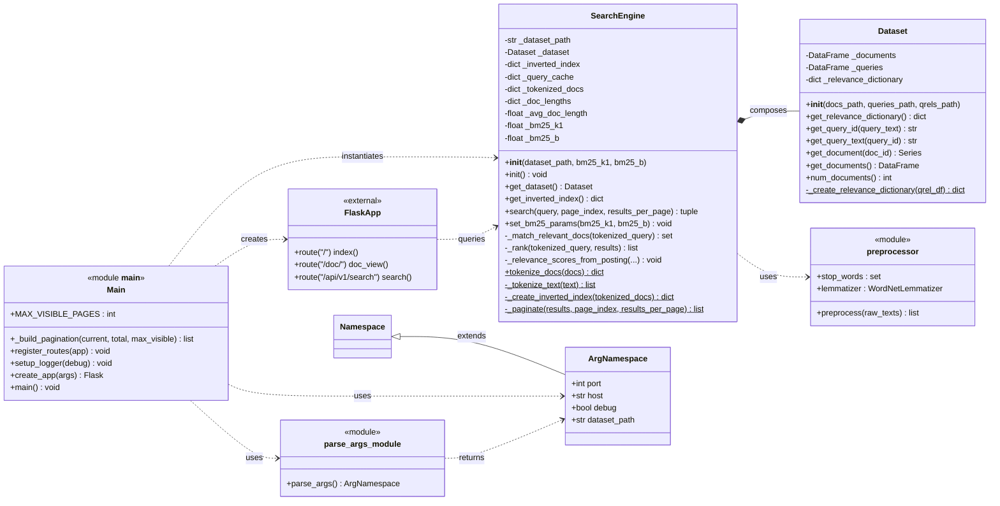

# SearchEngine — UML Class Diagram

## Notes

- `SearchEngine` composes a `Dataset` (built in `init()`) and delegates tokenization to the `preprocessor` module.
- `ArgNamespace` extends `argparse.Namespace` to provide typed CLI args; `parse_args()` returns it.
- `__main__` is the Flask entry point — it wires CLI args, builds the app, instantiates `SearchEngine`, and registers the `/`, `/doc/<doc_id>`, and `/api/v1/search` routes.
- `benchmark.py` is intentionally omitted.